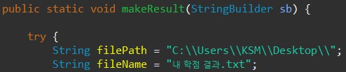
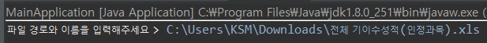
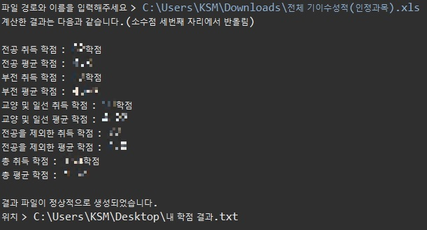

# Grade_Calculator-Woosong

## 학점 계산기(우송대학교)

##### 전공, 부전공, 교양 및 일선 과목의 취득 학점과 평균 학점을 쉽게 알 수 있는 프로그램

우송대학교 종합정보시스템에서 제공하는 엑셀 파일을 활용합니다.

기업 지원서를 작성할 때 이수 구분별로 기입하는 란이 의외로 여러 번 있었기에 매번 계산해야 했습니다. 모교는 총 취득 학점만 나와서 직접 계산을 해야 했고, 엑셀 보고 하나하나 계산하고 있는 자신에게 현타가 와서 직접 만들었습니다. ~~(옆 동네 충X대학교에서는 모든 정보를 편하게 제공해주는 것을 보고 울화통 ㅠㅠ)~~

<br>

### Development Environment

- Eclipse (JDK 1.8)
- LIbrary(Apache POI)

### Getting Started

- #### 엑셀 파일 다운로드
  - 대학정보시스템 - 성적 - 성적관리 -  기이수성적조회/출력

    

    조회 버튼을 누르고 엑셀 버튼으로 xls 파일 다운로드

- #### Import Project

  1. Clone Project

     ```
     git clone https://github.com/seongmink/Grade_Calculator-Woosong.git
     ```

  2. Package Explorer - Import - Existing Projects into Workspace  - Select root directory에서 Browse - grade_calculator 폴더 선택 - Finish

- #### 경로

  - ##### 파일 저장 위치 설정(makeResult 메소드)

  

  본인 같은 경우는 사용자 이름이 KSM 이므므로 filePath에 위와 같은 경로로 지정했습니다. 바탕화면에 저장하고 싶다면 KSM 대신 자신의 사용자 이름으로 지정하면 됩니다. 지정한 경로와 이름으로 txt 파일이 생성됩니다.

- #### 실행

  MainApplication 우 클릭 - Run As - Java Application

  

  파일의 경로, 이름과 확장자를 함께 입력합니다.

### Preview Result



위와 같이 Console에 결과가 출력되고, 해당 위치에 txt파일로 저장됩니다.

### Issues

1. ##### Library 문제

   xls 파일을 읽고 처리하는 것을 Apache POI 라이브러리를 사용했습니다. 라이브러리 문제가 있을 경우는 다음과 같이 해결이 가능합니다.

   - 라이브러리 다운로드(poi, commons-math)

     - https://mvnrepository.com/artifact/org.apache.poi/poi/4.1.2

     - https://mvnrepository.com/artifact/org.apache.commons/commons-math3/3.6.1

       위 링크 클릭 후 각각의 jar파일 다운로드 진행

   - 프로젝트 우클릭 - Build Path - Add External Archives... -  다운받은 jar파일 추가

2. ##### JDK 문제

   - JDK 1.8 이상 : POI 4.0 버전 이상 사용
- JDK 1.6 이상 : POI 3.11 버전 이상 사용
   - JDK 1.5 이상 : POI 3.5 ~ 3.10 버전 사용